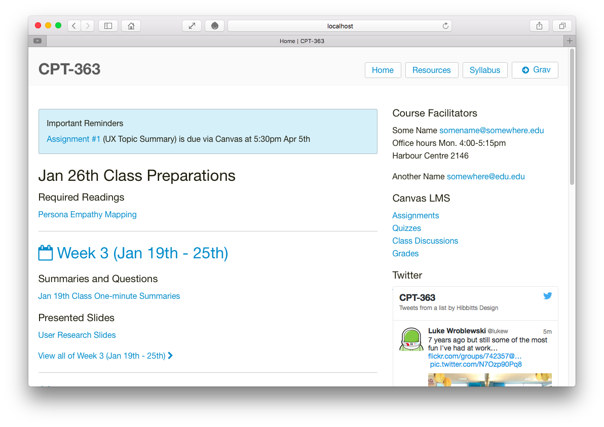

# Bones Vanilla Course Companion Skeleton



This is a sample skeleton site for a 13 week course companion site, intended to accompany a face-to-face course. It also support a [flipped-LMS approach](http://hibbittsdesign.org/blog/posts/flipped-lms-using-an-open-and-collaborative-platform) using Grav as an open and collaborative platform.

# Features

* Blog-format, where each week preparations and materials can be shared
* Important course reminders are displayed at the top of the homepage
* External links (e.g. LMS items) are automatically opened in a new Browser Window
* Sidebar is a simple markdown file that can be edited as needed
* URL flag support to display only content, for rendering within LMS pages. For example, http://hibbittsdesign.com/prototypes/bootstrap-course-companion/blog/week-01/onlydisplaypagecontent:true
* Integrated support for course materials to be sourced/maintained via GitHub
* Because the course companion is built with Grav, you can further customize it any way you like. Learn more about building with Grav at [http://learn.getgrav.org/](http://learn.getgrav.org/).

If you are not already familiar with Grav, it is suggested you first review [The Basics of Grav](http://learn.getgrav.org/)


# Configuration

The 'site.yaml' file located in the '/user/config/' folder contains the following default values:
```
title: CPT-363
metadata:
    description: 'A short description of your course companion would go here'
menu:
    - text: Grav
      icon: arrow-circle-right
      url: http://getgrav.org/
icon:
    preparations: check-circle
    posts: calendar-o
github:
    enabled: true
    tree: https://github.com/hibbitts-design/grav-skeleton-bootstrap-course-companion-prototype/edit/master/user/
```

| Setting | Child Setting | Description                                                                                                            |
|---------|---------------|------------------------------------------------------------------------------------------------------------------------|
| title   |               | The course number/id, to be displayed at the top of every page.                                                      |
| metadata  |  description | The short description of the course companion site                                       |
| menu  |  text | Text label for external links to be included on navbar                                       |
| menu  |  icon | Font awesome icon code for external link (optional)                                        |
| menu  |  url | URL for external link
|                                       |
| icon  | preparations    | Change the default font awesome icon for the preparation area on the home page.
|
| icon  | posts          | Change the default font awesome icon for the weekly blog posts (i.e. weekly summaries).            |
| github  | enabled       | Can be set to `true` or `false`. When set to `true`, it generates the **Edit this page** link to GitHub for each page. |
| github  | tree          | Sets the tree by which your site's content is based. Generally the repo your site's content is pulled from.            |

## Quick Setup for a New Grav Bootstrap Course Companion Site

1. [Download Bootstrap Course Companion Skeleton zip archive](https://github.com/hibbitts-design/grav-skeleton-bones-vanilla-course-companion-prototype/archive/master.zip)
2. Unzip the package into your web root folder.
3. Point your browser at the folder.
4. Enjoy the course companion!

To fully enjoy the benefits of the workflow that Grav can support, please read the step-by-step guide [Running Grav Locally with MAMP](http://hibbittsdesign.org/blog/posts/running-grav-locally-with-mamp) and [Using Grav with GitHub Desktop (and Deploy)](http://hibbittsdesign.org/blog/posts/using-grav-with-github-and-deploy).

**TIP:** Check out the [general Grav Installation Instructions](http://learn.getgrav.org/basics/installation) for more details on this process.

---
